# Assignment One: Android and Sensors

Author: Xi Wang

### Part A: Setup your App

The screenshot of two activities:

- MainActivity:

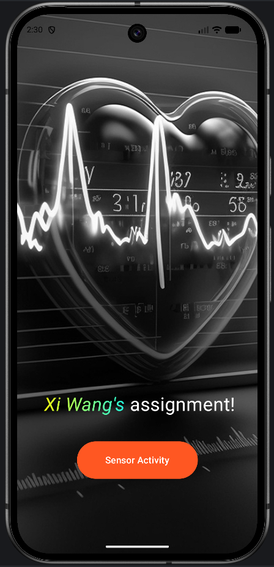

- SensorActivity:

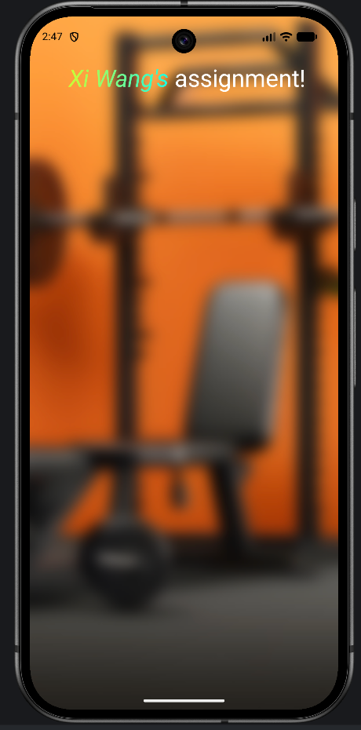

In this section, I mostly read the official documentation provided by Android to learn how to
develop, which covers topics such as layout, text, buttons, and images, along with the corresponding
links:

- https://developer.android.com/develop/ui/compose/layouts/basics
- https://developer.android.com/develop/ui/compose/text/style-text
- https://developer.android.com/develop/ui/compose/components/button
- https://developer.android.com/develop/ui/compose/graphics/images/customize

When I use AI, I just ask him give me an example for development.

#### Background Picture

I found the background picture for a fitness app on <i>[Figma](https://www.figma.com/)</i>. When I
wanted
to add this picture, I got
stuck, so I asked Gemini for help with the prompt:

```
Can you give me an example of how to add pictures as background in my app using Jetpack Compose?
```

**Gemini's response:**

```Kotlin
import androidx.compose.foundation.Image
import androidx.compose.foundation.layout.Box
import androidx.compose.foundation.layout.Column
import androidx.compose.foundation.layout.fillMaxSize
import androidx.compose.foundation.layout.padding
import androidx.compose.material3.MaterialTheme
import androidx.compose.material3.Surface
import androidx.compose.material3.Text
import androidx.compose.runtime.Composable
import androidx.compose.ui.Alignment
import androidx.compose.ui.Modifier
import androidx.compose.ui.graphics.Color
import androidx.compose.ui.layout.ContentScale
import androidx.compose.ui.res.painterResource
import androidx.compose.ui.unit.dp
import com.example.yourapp.R // Replace with your actual R class package

@Composable
fun BackgroundImageScreen() {
    // A Box allows you to stack elements on top of each other
    Box(
        modifier = Modifier.fillMaxSize()
    ) {
        // 1. The Background Image
        Image(
            painter = painterResource(id = R.drawable.your_background_image), // Place your image in res/drawable
            contentDescription = "Background Image",
            modifier = Modifier.fillMaxSize(),
            // ContentScale.Crop ensures the image fills the screen while maintaining its aspect ratio
            contentScale = ContentScale.Crop
        )

        // 2. Your App Content (layered on top of the image)
        Column(
            modifier = Modifier
                .fillMaxSize()
                .padding(24.dp),
            horizontalAlignment = Alignment.CenterHorizontally,
            alignment = Alignment.CenterVertically // Or use appropriate layout alignment
        ) {
            Text(
                text = "Welcome to My App",
                style = MaterialTheme.typography.headlineLarge,
                color = Color.White // Use a contrasting color for readability
            )

            Text(
                text = "This content is placed over a background image.",
                style = MaterialTheme.typography.bodyLarge,
                color = Color.LightGray,
                modifier = Modifier.padding(top = 8.dp)
            )
        }
    }
}
```

I used the example code to fit my app and integrated it into my own code structure.

### Navigation Between Activities

To implement navigation between the two activities (`MainActivity` and `SensorActivity`), I asked
Gemini:

```
How to jump into the new activity by using Jetpack Compose when I click button on my MainActivity? Why? Please give me an example.
```

**Gemini's response:**
Gemini explained that I should use an Android `Intent` inside the button's `onClick` lambda, and
reminded me to declare the new activity inside the `AndroidManifest.xml` file.

```Kotlin
package com.example.myapplication

import android.content.Intent
import android.os.Bundle
import androidx.activity.ComponentActivity
import androidx.activity.compose.setContent
import androidx.compose.foundation.layout.Box
import androidx.compose.foundation.layout.fillMaxSize
import androidx.compose.material3.Button
import androidx.compose.material3.MaterialTheme
import androidx.compose.material3.Surface
import androidx.compose.material3.Text
import androidx.compose.ui.Alignment
import androidx.compose.ui.Modifier
import com.example.myapplication.ui.theme.MyApplicationTheme

class MainActivity : ComponentActivity() {
    override fun onCreate(savedInstanceState: Bundle?) {
        super.onCreate(savedInstanceState)
        setContent {
            MyApplicationTheme {
                Surface(
                    modifier = Modifier.fillMaxSize(),
                    color = MaterialTheme.colorScheme.background
                ) {
                    Box(
                        modifier = Modifier.fillMaxSize(),
                        contentAlignment = Alignment.Center
                    ) {
                        val context = LocalContext.current
                        Button(onClick = {
                            // 1. Create an Intent pointing to SecondActivity
                            val intent = Intent(context, SecondActivity::class.java)

                            // 2. Start the new Activity
                            context.startActivity(intent)
                        }) {
                            Text(text = "Jump to Second Activity")
                        }
                    }
                }
            }
        }
    }
}
```

```xml

<application...>

    <activity android:name=".MainActivity" android:exported="true">
        <intent-filter>
            <action android:name="android.intent.action.MAIN" />
            <category android:name="android.intent.category.LAUNCHER" />
        </intent-filter>
    </activity>

    <!-- Register the SecondActivity here -->
    <activity android:name=".SecondActivity" android:exported="false" />

</application>
```

Based on the example, I modified my version and successfully implemented the click function to
navigate from `MainActivity` to `SensorActivity`.

### Part B: Connect to one Sensor

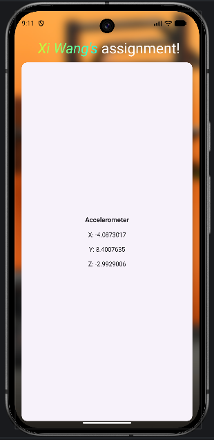

I read the documentation showed below and finished my implementation of accelerate sensor without
using AI:
https://developer.android.com/develop/sensors-and-location/sensors/sensors_overview

### Part C: Connect to five Sensors

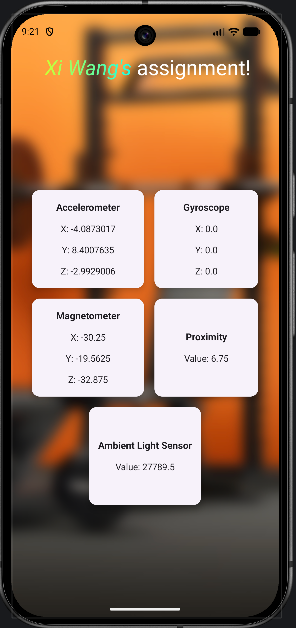

I did not use AI at this part. I finished this part by reading the documentation.
As the screenshot showed, I implemented the sensors as below:

- Accelerometer
- Gyroscope
- Magnetometer
- Proximity
- Ambient Light Sensor

### Part D: Connect to all Sensors

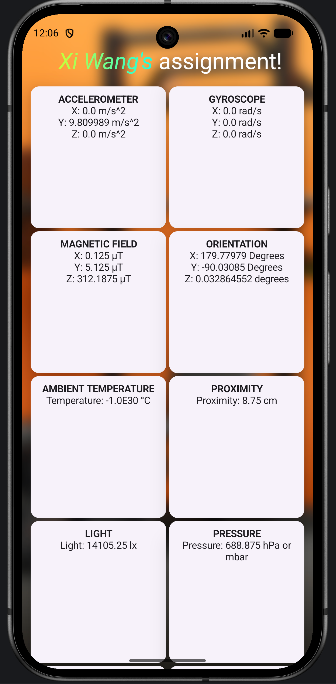
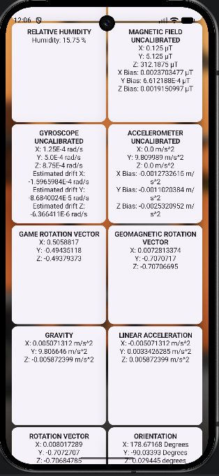
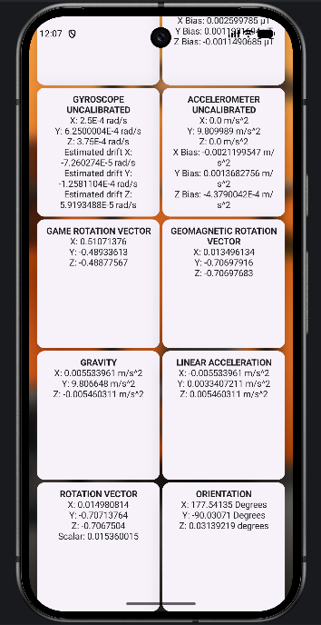

I did not use AI at this part. I just use the Android document as the same path from the previous
section.

The code on the document showcases how to get the list of all sensors.

```kotlin
val deviceSensors: List<Sensor> = sensorManager.getSensorList(Sensor.TYPE_ALL)
```

After get the list of all sensors, I read the parameters of each sensor and implemented them in my
code, which include:

- Accelerometer
- Gyroscope
- Magnetic Field
- Orientation
- Ambient Temperature
- Proximity
- Light
- Pressure
- Relative Humidity
- Magnetic Field Uncalibrated
- Gyroscope Uncalibrated
- Accelerometer Uncalibrated
- Game Rotation Vector
- Geomagenetic Rotation Vector
- Gravity
- Linear Acceleration
- Rotation Vector
- Orientation

### Part E: Responsive Design

I chose three type of devises in this part, including pixel 9, pixel tablets, and small phone.

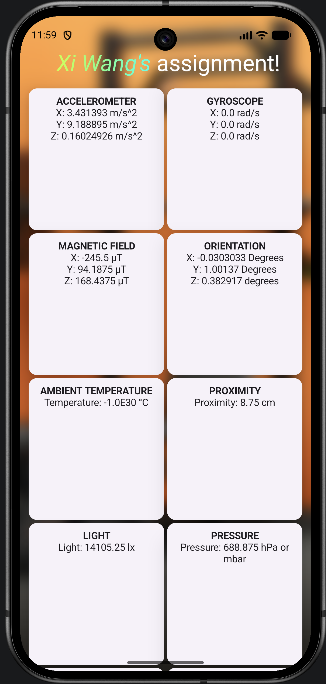
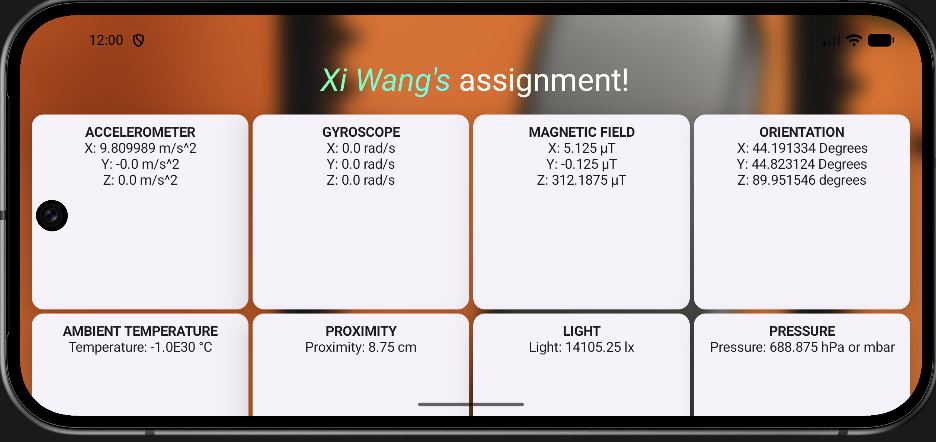
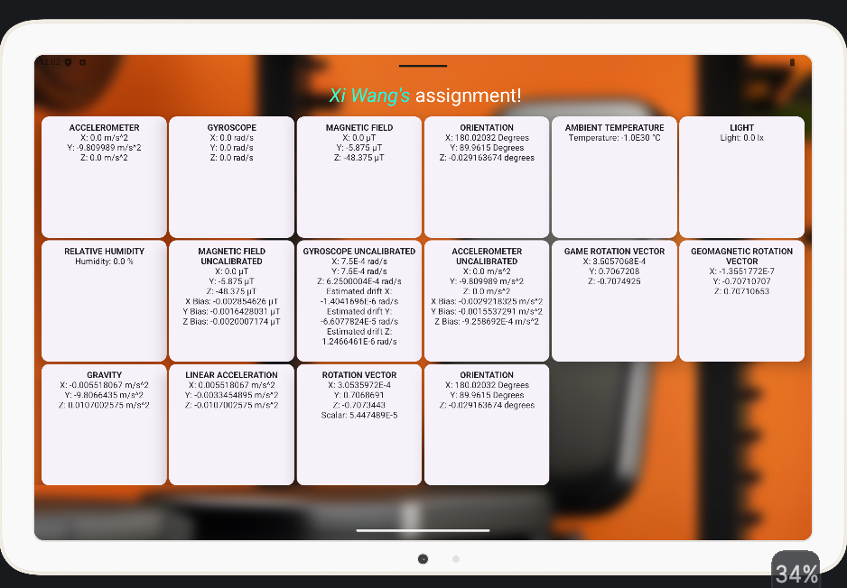

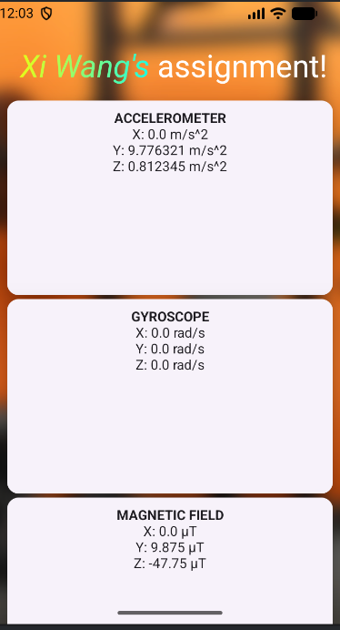
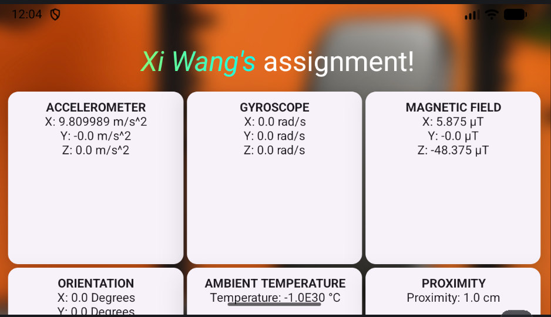

I do not use AI at this part. As alternative, I found the solution
from <i>[Lazy lists and lazy grids](https://developer.android.com/develop/ui/compose/lists)</i> on
the Android document. When we choose different devices or change the direction, the LazyGrid could
adapt different screen.