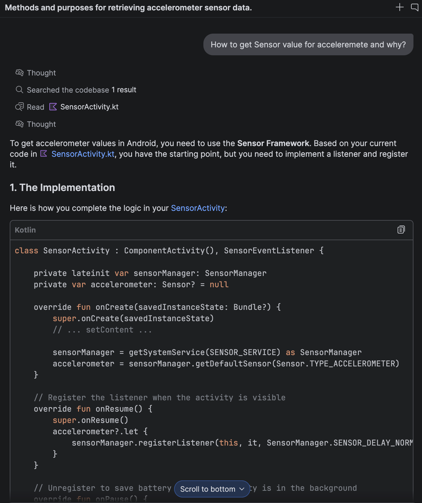

# Assignment One: Android and Sensors

### Part A: Setup your App

The screenshot of two activities:

- MainActivity:


- SensorAssignment：


In this section, I initially read the official documentation provided by Android to learn how to
develop, which covers topics such as text and buttons, along with the corresponding
links:

- https://developer.android.com/develop/ui/compose/text/style-text
- https://developer.android.com/develop/ui/compose/components/button

#### Background Picture

I found the background picture for a fitness app on Figma. When I wanted to add this picture, I got
stuck, so I asked Gemini for help with the prompt:

```
Can you give me an example of how to add pictures as background in my app using Jetpack Compose?
```

**Gemini's response:**

```Kotlin
import androidx.compose.foundation.Image
import androidx.compose.foundation.layout.Box
import androidx.compose.foundation.layout.Column
import androidx.compose.foundation.layout.fillMaxSize
import androidx.compose.foundation.layout.padding
import androidx.compose.material3.MaterialTheme
import androidx.compose.material3.Surface
import androidx.compose.material3.Text
import androidx.compose.runtime.Composable
import androidx.compose.ui.Alignment
import androidx.compose.ui.Modifier
import androidx.compose.ui.graphics.Color
import androidx.compose.ui.layout.ContentScale
import androidx.compose.ui.res.painterResource
import androidx.compose.ui.unit.dp
import com.example.yourapp.R // Replace with your actual R class package

@Composable
fun BackgroundImageScreen() {
    // A Box allows you to stack elements on top of each other
    Box(
        modifier = Modifier.fillMaxSize()
    ) {
        // 1. The Background Image
        Image(
            painter = painterResource(id = R.drawable.your_background_image), // Place your image in res/drawable
            contentDescription = "Background Image",
            modifier = Modifier.fillMaxSize(),
            // ContentScale.Crop ensures the image fills the screen while maintaining its aspect ratio
            contentScale = ContentScale.Crop 
        )

        // 2. Your App Content (layered on top of the image)
        Column(
            modifier = Modifier
                .fillMaxSize()
                .padding(24.dp),
            horizontalAlignment = Alignment.CenterHorizontally,
            alignment = Alignment.CenterVertically // Or use appropriate layout alignment
        ) {
            Text(
                text = "Welcome to My App",
                style = MaterialTheme.typography.headlineLarge,
                color = Color.White // Use a contrasting color for readability
            )
            
            Text(
                text = "This content is placed over a background image.",
                style = MaterialTheme.typography.bodyLarge,
                color = Color.LightGray,
                modifier = Modifier.padding(top = 8.dp)
            )
        }
    }
}
```

I used the example code to fit my app and integrated it into my own code structure.

### Navigation Between Activities

To implement navigation between the two activities (`MainActivity` and `SensorActivity`), I asked
Gemini:

```
How to jump into the new activity by using Jetpack Compose when I click button on my MainActivity? Why? Please give me an example.
```

**Gemini's response:**
Gemini explained that I should use an Android `Intent` inside the button's `onClick` lambda, and
reminded me to declare the new activity inside the `AndroidManifest.xml` file.

```Kotlin
package com.example.myapplication

import android.content.Intent
import android.os.Bundle
import androidx.activity.ComponentActivity
import androidx.activity.compose.setContent
import androidx.compose.foundation.layout.Box
import androidx.compose.foundation.layout.fillMaxSize
import androidx.compose.material3.Button
import androidx.compose.material3.MaterialTheme
import androidx.compose.material3.Surface
import androidx.compose.material3.Text
import androidx.compose.ui.Alignment
import androidx.compose.ui.Modifier
import com.example.myapplication.ui.theme.MyApplicationTheme

class MainActivity : ComponentActivity() {
    override fun onCreate(savedInstanceState: Bundle?) {
        super.onCreate(savedInstanceState)
        setContent {
            MyApplicationTheme {
                Surface(
                    modifier = Modifier.fillMaxSize(),
                    color = MaterialTheme.colorScheme.background
                ) {
                    Box(
                        modifier = Modifier.fillMaxSize(),
                        contentAlignment = Alignment.Center
                    ) {
                        Button(onClick = {
                            // 1. Create an Intent pointing to SecondActivity
                            val intent = Intent(this@MainActivity, SecondActivity::class.java)

                            // 2. Start the new Activity
                            startActivity(intent)
                        }) {
                            Text(text = "Jump to Second Activity")
                        }
                    }
                }
            }
        }
    }
}
```

```xml

<application...>

    <activity android:name=".MainActivity" android:exported="true">
        <intent-filter>
            <action android:name="android.intent.action.MAIN" />
            <category android:name="android.intent.category.LAUNCHER" />
        </intent-filter>
    </activity>

    <!-- Register the SecondActivity here -->
    <activity android:name=".SecondActivity" android:exported="false" />

</application>
```

Based on the example, I modified my version and successfully implemented the click function to
navigate from `MainActivity` to `SensorActivity`.

### Part B: Connect to one Sensor

### Part C: Connect to five Sensors

### Part D: Connect to all Sensors

### Part E: Responsive Design

I found Layouts introduction in the documentation showed
on https://developer.android.com/develop/ui/compose/layouts/basics

2. I ask Gemini about how to write get sensor value and why is it.



3. When I tried using object to refresh the page, there is no changes. So I asked Gemini

4.How can I get my new picture as MainActivities background picture?

5. 样式：安卓开发怎么添加全局背景 添加图片背景呢？why this font size is sp not fontSize = 54.sp not
   dp? 第二个页面：毛玻璃 橫屏沒辦法拖懂